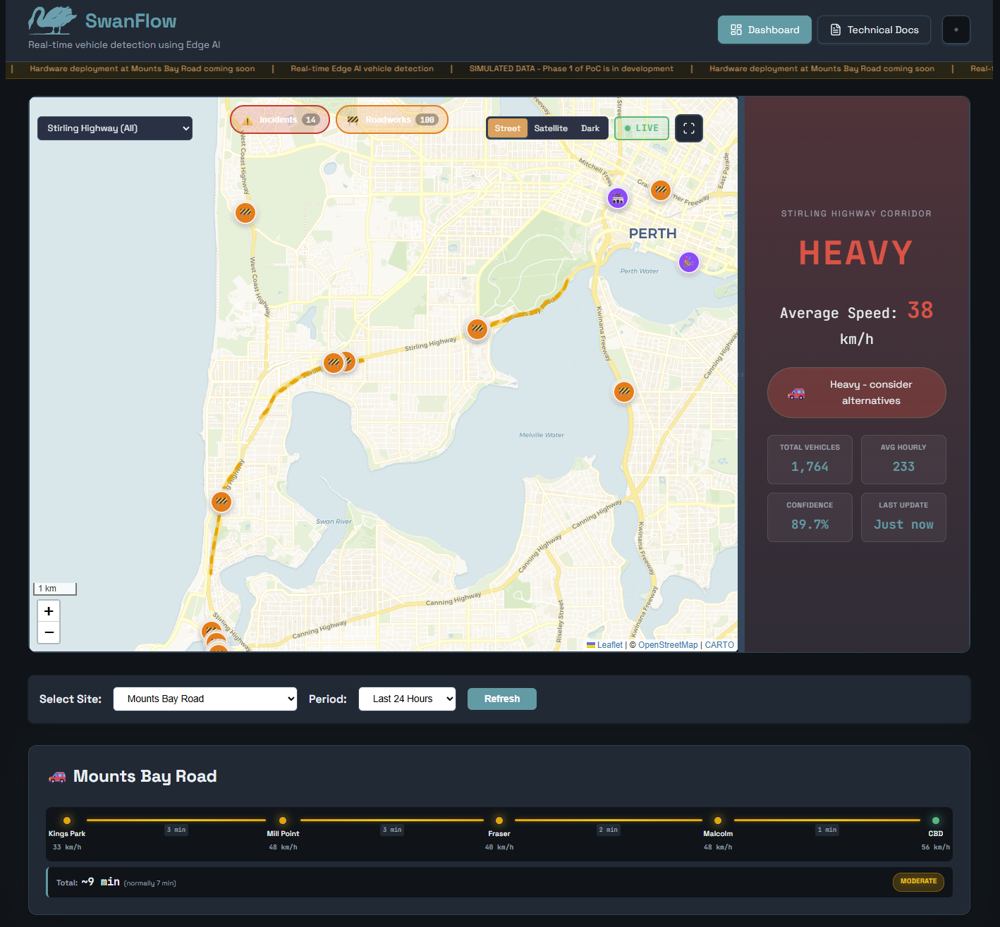

# Perth Traffic Watch 🚗📊

**Open-source vehicle detection system using Edge AI, ESP32-CAM, and FOMO (Faster Objects, More Objects)**

Monitor traffic flow in real-time using affordable IoT hardware and machine learning at the edge.


---

## What is Perth Traffic Watch?

Perth Traffic Watch is a DIY traffic monitoring system that:

- 📸 **Detects vehicles** using Edge Impulse FOMO (ML model)
- 🌐 **Uploads data** via 4G/LTE (SIM7000A modem)
- 📊 **Visualises traffic** on a real-time web dashboard
- 💰 **Costs ~$150 AUD** per monitoring site
- 🔋 **Runs 24/7** on mains or solar power

Perfect for:
- Traffic analysis (peak hours, trends)
- Research projects (urban planning, transport)
- Hobbyists (IoT, ML, embedded systems)
- Community projects (local traffic advocacy)

---

## Dashboard Preview



**Real-time traffic monitoring dashboard featuring:**
- 🗺️ **Interactive Map** - Live traffic visualization with color-coded markers
- 📊 **Traffic Flow Corridor** - Directional flow analysis along Mounts Bay Road
- 📈 **Hourly Charts** - Historical traffic patterns with Chart.js
- 🎨 **WA-Themed UI** - Cottesloe Beach and Indigenous Earth color schemes (light/dark modes)

---

## Features

### Hardware
- **ESP32-CAM** (OV2640 camera) - $8-12
- **SIM7000A** (4G LTE module) - $15-20
- **Edge Impulse FOMO** (on-device ML inference)
- **MicroSD** for local image buffering
- **Weatherproof** (IP65 junction box)
- **Solar-powered** (optional, off-grid)

### Firmware
- PlatformIO (Arduino framework)
- Real-time vehicle counting
- Configurable detection thresholds
- SD card logging
- LTE data upload (via TinyGSM)
- Watchdog and error recovery

### Backend
- Express.js REST API
- SQLite database
- Aggregated statistics (hourly, daily, monthly)
- Authentication (API key)
- CORS-enabled for dashboard

### Frontend
- Real-time dashboard (Chart.js)
- Traffic flow visualisation
- Multi-site support
- Mobile-responsive
- Auto-refresh (60s interval)

---

## Quick Start

### Phase 1: Order Hardware (Today!)

See [hardware/shopping-lists.md](hardware/shopping-lists.md) for complete shopping list.

**AliExpress** (2-4 week shipping):
- 2x ESP32-CAM (OV2640)
- 1x SIM7000A LTE module
- 1x USB-to-TTL programmer
- 2x MicroSD cards (8-16GB)

**Bunnings** (same day):
- IP65 junction box
- Cable glands
- Mounting bracket
- Outdoor power cable

**M2M SIM Card**:
- Register at [m2msim.com.au](https://m2msim.com.au)
- 1GB/month plan (~$5-8/month)

**Total Budget**: ~$150 AUD (Phase 1)

### Phase 2: Train ML Model (While Hardware Ships)

1. Create account at [Edge Impulse Studio](https://studio.edgeimpulse.com)
2. Collect 300-500 training images (use phone or ESP32-CAM)
3. Label vehicles in Edge Impulse
4. Train FOMO model (see [docs/ml-development-guide.md](docs/ml-development-guide.md))
5. Export as Arduino library

### Phase 3: Flash Firmware (When Hardware Arrives)

```bash
cd firmware/esp32-cam-counter

# Install PlatformIO
pip install platformio

# Update config.h with your settings
# - WiFi credentials (for initial testing)
# - M2M APN settings
# - Server URL
# - API key

# Build and upload
pio run -t upload

# Monitor serial output
pio device monitor
```

### Phase 4: Deploy Backend

```bash
cd backend/api

# Install dependencies
npm install

# Configure environment
cp .env.example .env
nano .env  # Set API_KEY

# Run server
npm start
```

Backend runs on [http://localhost:3000](http://localhost:3000)

### Phase 5: Launch Dashboard

```bash
cd frontend/web-dashboard

# Serve locally (Python)
python -m http.server 8080

# Or deploy to Vercel (free)
vercel
```

Dashboard accessible at [http://localhost:8080](http://localhost:8080)

### Phase 6: Site Survey & Installation

1. Complete [docs/site-survey-checklist.md](docs/site-survey-checklist.md)
2. Install junction box and mount ESP32-CAM
3. Power on and verify LTE connection
4. Monitor dashboard for 24 hours

---

## Repository Structure

```
perth-traffic-watch/
├── hardware/
│   ├── bom.md                    # Bill of materials
│   └── shopping-lists.md         # AliExpress + Bunnings orders
│
├── firmware/
│   └── esp32-cam-counter/
│       ├── platformio.ini        # PlatformIO config
│       └── src/
│           ├── main.cpp          # Main loop
│           ├── config.h          # All configuration
│           ├── vehicle_counter.* # FOMO detection + counting
│           └── lte_modem.*       # SIM7000A communication
│
├── backend/
│   └── api/
│       ├── package.json
│       ├── index.js              # Express API + SQLite
│       └── README.md             # Backend setup guide
│
├── frontend/
│   └── web-dashboard/
│       ├── index.html
│       ├── styles.css
│       ├── app.js                # Dashboard logic (Chart.js)
│       └── README.md             # Frontend setup guide
│
├── docs/
│   ├── ml-development-guide.md   # Edge Impulse training guide
│   ├── iot-sim-options.md        # M2M SIM comparison (Australia)
│   ├── requirements-and-todos.md # Project roadmap
│   ├── legal-considerations.md   # Privacy, permits, compliance
│   ├── site-survey-checklist.md  # Field survey template
│   └── contributing.md           # How to contribute
│
└── README.md                     # This file
```

---

## How It Works

### 1. Vehicle Detection (ESP32-CAM)

```
Camera → FOMO Inference → Counting Algorithm → Stats
```

- ESP32-CAM captures frame (QVGA 320x240)
- Edge Impulse FOMO detects vehicles (on-device)
- Counting algorithm tracks vehicles crossing virtual line
- Accumulates stats: total count, hourly count, confidence

### 2. Data Upload (SIM7000A)

```
ESP32 → SIM7000A → 4G LTE → Backend API
```

- Every 60 seconds, upload JSON stats to backend
- Optional: Upload detection images for validation
- Uses ~200-500MB/month data

### 3. Backend Storage (Express + SQLite)

```
API → SQLite → Aggregation → Dashboard
```

- Stores detection events in SQLite
- Aggregates statistics (hourly, daily)
- Serves data to web dashboard via REST API

### 4. Visualisation (Web Dashboard)

```
Dashboard → Fetch API → Chart.js → User
```

- Real-time traffic statistics
- Hourly traffic flow chart
- Recent detections table
- Auto-refresh every 60 seconds

---

## Accuracy

**Target**: >70% detection accuracy in real-world conditions

**Factors affecting accuracy**:
- ✅ Good lighting (daytime, well-lit roads)
- ❌ Poor lighting (night, heavy shadows)
- ✅ Clear camera view
- ❌ Occlusions (trees, rain, fog)
- ✅ Medium traffic density
- ❌ Very high density (overlapping vehicles)

**Validation**: Manual count vs. automated count over 1 hour

---

## Cost Breakdown

### Phase 1: Single Site (Proof of Concept)

| Component | Cost (AUD) |
|-----------|------------|
| ESP32-CAM | $12 |
| SIM7000A LTE module | $20 |
| MicroSD card | $8 |
| Junction box + mounting | $25 |
| Cables, glands, misc | $15 |
| M2M SIM (first month) | $7 |
| **Total** | **~$150** |

### Phase 2: Multi-Site (5 sites)

- Bulk discounts: ~$120/site
- Data pooling: Share 5GB across 5 devices (~$12/month total)
- **Total**: ~$600 hardware + $12/month

### Phase 3: Solar Power (Off-Grid)

- 20W solar panel + battery: +$80/site
- No ongoing power costs

---

## Roadmap

### ✅ Phase 1: Proof of Concept (Current)
- [x] Hardware BOM and shopping list
- [x] Firmware structure (PlatformIO)
- [x] Backend API (Express + SQLite)
- [x] Web dashboard (Chart.js)
- [x] Documentation
- [ ] Edge Impulse model training
- [ ] Field deployment at Mounts Bay Road

### 🔄 Phase 2: Single Site Deployment (2-4 Weeks)
- [ ] ML model training (300-500 images)
- [ ] Firmware integration with FOMO
- [ ] Site survey (Mounts Bay Road)
- [ ] Installation and mounting
- [ ] 24-hour field testing
- [ ] Accuracy validation (>70%)

### 📋 Phase 3: Multi-Site Expansion (1-3 Months)
- [ ] Survey 5-10 additional sites
- [ ] Bulk hardware order
- [ ] Data pooling (shared SIM plan)
- [ ] Staged rollout (1 site/week)
- [ ] Central monitoring dashboard

### 🚀 Phase 4: Advanced Features (3-6 Months)
- [ ] Multi-class detection (cars, trucks, motorcycles)
- [ ] Direction detection (northbound vs. southbound)
- [ ] Speed estimation (optional)
- [ ] Alerts (email/SMS)
- [ ] Integration with Unif-eye Brain API
- [ ] Solar power deployment
- [ ] Mobile app (React Native)

See [docs/requirements-and-todos.md](docs/requirements-and-todos.md) for full roadmap.

---

## Documentation

| Document | Description |
|----------|-------------|
| [hardware/bom.md](hardware/bom.md) | Bill of materials |
| [hardware/shopping-lists.md](hardware/shopping-lists.md) | AliExpress + Bunnings orders |
| [docs/ml-development-guide.md](docs/ml-development-guide.md) | Edge Impulse FOMO training |
| [docs/iot-sim-options.md](docs/iot-sim-options.md) | M2M SIM comparison (Australia) |
| [docs/requirements-and-todos.md](docs/requirements-and-todos.md) | Project roadmap and TODOs |
| [docs/legal-considerations.md](docs/legal-considerations.md) | Privacy, permits, compliance |
| [docs/site-survey-checklist.md](docs/site-survey-checklist.md) | Site evaluation template |
| [docs/contributing.md](docs/contributing.md) | How to contribute |
| [backend/README.md](backend/README.md) | Backend API setup |
| [frontend/README.md](frontend/README.md) | Dashboard setup |

---

## FAQ

### Q: Is this legal?

**A**: Recording vehicles on public roads is generally legal in Australia (WA Surveillance Devices Act 2016). However:
- Don't record audio (requires consent)
- Don't record private property
- May need permit from City of Perth for installation

See [docs/legal-considerations.md](docs/legal-considerations.md) for details.

### Q: How accurate is it?

**A**: Target is >70% accuracy. Actual accuracy depends on:
- Camera angle and positioning
- Lighting conditions
- Traffic density
- Model training quality

Validate with manual counts.

### Q: What about privacy?

**A**: Perth Traffic Watch:
- ✅ Uses low-resolution images (QVGA 320x240)
- ✅ No facial recognition
- ✅ No number plate recognition
- ✅ No audio recording
- ✅ Anonymous vehicle counts only

### Q: Can I use this commercially?

**A**: Yes! MIT License allows commercial use. However:
- Consult legal advice for privacy compliance
- May need public liability insurance
- Check local regulations

### Q: What's the data usage?

**A**: Estimated ~200-500MB/month per device:
- Stats only: ~9MB/month
- Stats + occasional images: ~150MB/month

### Q: Does it work at night?

**A**: Depends on street lighting:
- Well-lit roads: Yes (requires good ambient light)
- Poorly lit roads: May need IR illumination
- Test at night before deployment

### Q: Can I use WiFi instead of 4G?

**A**: Yes! ESP32-CAM has built-in WiFi:
- Cheaper (no SIM card)
- Requires WiFi access point nearby
- Update firmware to use WiFi instead of LTE

### Q: What about solar power?

**A**: Absolutely!
- 20W solar panel + 12V battery
- Runs 24/7 off-grid
- Add ~$80 to hardware cost

---

## Tech Stack

| Component | Technology |
|-----------|------------|
| **Hardware** | ESP32-CAM (OV2640), SIM7000A, MicroSD |
| **Firmware** | Arduino (ESP32), PlatformIO, TinyGSM |
| **ML Model** | Edge Impulse FOMO, TensorFlow Lite Micro |
| **Backend** | Node.js, Express.js, SQLite, better-sqlite3 |
| **Frontend** | Vanilla JS, Chart.js, HTML5, CSS3 |
| **Deployment** | Vercel (frontend), VPS/Hetzner (backend) |

---

## Contributing

Contributions welcome! See [docs/contributing.md](docs/contributing.md) for guidelines.

Ways to contribute:
- 🐛 Report bugs
- 💡 Suggest features
- 📝 Improve documentation
- 🧪 Field testing
- 🤖 ML model improvements
- �� Hardware alternatives

---

## License

**MIT License** - see [LICENSE](LICENSE) for details.

Free to use, modify, and distribute. No warranty.

---

## Acknowledgements

- **Edge Impulse** - FOMO object detection
- **Espressif** - ESP32 platform
- **TinyGSM** - Modem library
- **Chart.js** - Dashboard visualisation
- **Macdara's Unif-eye** - Cross-project brain API

---

## Contact

- **GitHub Issues**: Report bugs and request features
- **GitHub Discussions**: Ask questions and share ideas
- **Unif-eye Brain**: https://unif-eye.vercel.app/api/donnacha/brain
- **Email**: (TBD)

---

## Related Projects

- **Unif-eye Dashboard**: https://unif-eye.vercel.app (Macdara's central hub)
- **Donnacha AI**: Voice assistant integration (planned)
- **Edge Impulse**: https://edgeimpulse.com
- **ESP32-CAM Community**: https://github.com/espressif/esp32-camera

---

**Built with ❤️ in Perth, Western Australia**

*Open-source traffic monitoring for everyone.*

---

## Next Steps (For You!)

1. ⭐ Star this repository
2. 🛒 Order hardware (see [hardware/shopping-lists.md](hardware/shopping-lists.md))
3. 📸 Collect training images
4. 🤖 Train FOMO model (see [docs/ml-development-guide.md](docs/ml-development-guide.md))
5. 🚀 Deploy and share your results!

**Questions?** Open an issue or discussion on GitHub.

---

**Status**: Proof of Concept (Phase 1)
**Version**: 0.1.0
**Last Updated**: 2025-12-14
